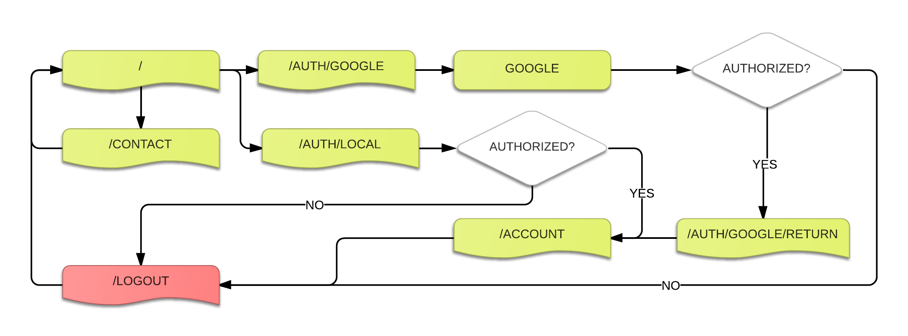

Havaianas-Node
==============

It will be a boiller plate project with authentication with Google.

The project has Google Authentication done. This is the TODO list:
* Perform authentication against local credentials.
* Create local users from Google Authentication after approval.
* Implement persistence with Mongo DB.

